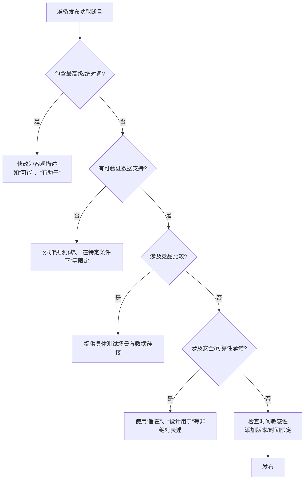

# 客观性与风险规避准则

>**页面摘要**：技术文档应基于可验证的事实，避免过度承诺和未来可能失效的断言，以维护长期可信度并降低法律风险。任何关于性能、成本、安全性的断言，若无法通过现有数据证实或可能在未来失效，均被视为“过度陈述”。

## 1. 什么是“过度陈述”？

过度陈述指文档中无法验证、可能失效或导致法律风险的断言，包括：

* **不可验证的数据**：提及性能或成本时，读者无法通过公开渠道查证。
* **绝对化的安全承诺**：做出无法保证的承诺，特别是安全、性能、可靠性方面。
* **主观性/贬低性评论**：对第三方产品进行主观评价或贬低。
* **时间敏感的绝对陈述**：未考虑未来技术变化可能使其失效的陈述。

>**为何避免过度陈述**？ 
> 过度陈述不仅会在事实变化时使文档失效，还可能带来法律风险，损害品牌可信度。

## 2. 写作指南与修辞纠偏

为了确保文档的“持久性”，请参考下表的修辞转换：

|   风险维度      |    风险表述      |     推荐策略   |  原则  |
|-----------|--------------|--------------|--------------|
| **性能比较** | “比 X 快30%”   | “在特定测试场景下，数据显示性能提升约30%”    |提供测试上下文与数据源|
| **安全保证** | “防止所有攻击” | “旨在防御常见攻击向量”  |安全没有绝对保证|
| **功能覆盖** | “解决所有问题”	|“针对以下典型场景提供解决方案”   | 限定范围 |
| **竞品对比**   | “比 X 快”  | “在 A、B 指标上，测试显示有优势”  |具体、可验证|

## 3. 正反例深度对比

通过以下例子可以看出，优秀的文档如何通过“加限定条件”来规避风险：

### 3.1 **性能描述**

* ✅ 正例：由于我们的产品在集群内存中分配数据集，因此在该场景下，其速度可能比 ExampleCorp 的产品更快。详见[性能对比报告]。

* ❌ 反例：我们的产品比 ExampleCorp 的产品更快。

* 理由：正例提供了逻辑支撑（内存分配）和数据来源，且使用了“可能”这一客观表述。

### 3.2 **安全性描述**

* ✅ 正例：使用我们的安全产品是整体策略的一部分，有助于防止钓鱼攻击导致的账号被盗。

* ❌ 反例：我们的安全产品能防止钓鱼攻击导致的账号被盗。

* 理由：安全没有绝对。如果产品被黑，反例的陈述将直接失效并导致法律责任。

## 4. 核心逻辑流：决策过程

## 5. 风险评估等级

* 🔴 **高风险（必须修改）**
  * 绝对安全承诺（“100%安全”、“无法被攻破”）
  * 无法验证的性能数据
  * 贬低竞争对手的表述
* 🟠 **中风险（建议修改）**
  * 缺少限定条件的时间陈述
  * 模糊的功能范围描述
  * 未注明来源的竞品比较
* 🟢 **低风险（可选修改）**
  * 技术背景下的专业表述
  * 有数据支持但可能需要更新
  * 行业内通用的非正式表述

## 附录：风险规避审查清单

### 内容审查

- [ ] 所有性能数据都有测试环境、时间戳和版本信息吗？
- [ ] 所有“保证”、“确保”都是法律上可承担的吗？
- [ ] 竞品比较有可公开验证的数据支持吗？
- [ ] 安全承诺使用了“旨在”、“帮助”等非绝对词吗？
- [ ] 时间相关陈述有明确的“当前”、“截至”等限定吗？

### 法律合规

- [ ] 检查了所在地区的广告法对“最”、“第一”等词的规范吗？
- [ ] 开源项目的承诺与商业产品的表述有区分吗？
- [ ] 有必要的免责声明吗？（位置适当、表述清晰）

### 禁词表

* **绝对词**：100%, 绝对, 保证, 实时（建议改为“低延迟”）, 永远。
* **主观形容词**：简单的, 容易的, 极快的（建议改为具体数值）。
* **贬低性词汇**：陈旧的, 笨重的（描述竞品时）。

最后更新于2026/01/29
