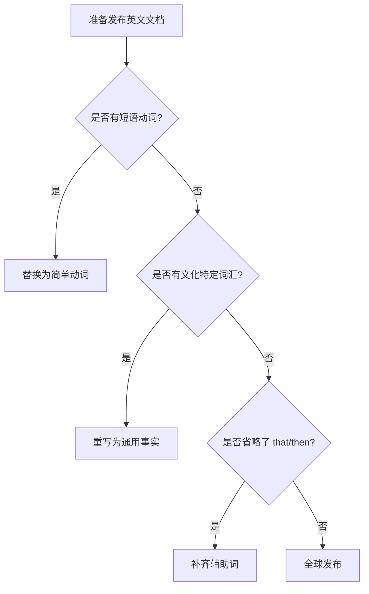

# 全球视野：面向国际受众的写作准则

>**页面摘要**：
>
>为了降低翻译成本并减少歧义，技术文档必须具备高度的**可翻译性（Translation）** 与 **国际化（Internationalization）** 意识。本文档提供了面向全球受众的写作准则。

## 1. 国际化工作流中的核心概念

技术产品的全球化是一个线性推进的过程，每个阶段的产出都是下一阶段的基础。

* **阶段一：国际化 (Internationalization)**
  这是“底座”。通过将字符串独立存放，避免硬编码，从而降低后续所有语言的适配成本。

* **阶段二：翻译 (Translation)**
  这是“桥梁”。不仅仅是字面的转译，更要求语法结构符合目标语言的技术逻辑。

* **阶段三：本地化 (Localization)**
  这是“装修”。处理货币格式（如 `￥` 或 `$`）、度量衡以及特定地区的法律声明。

## 2. 语言简化与去歧义

### 2.1 词汇选择：简单胜过华丽

避免使用生僻词，除非在特定技术场景下有特殊含义。

* ✅ **推荐**：`start`/`begin`, `so`, `use`.
* ❌ **避免**：`commence`, `consequently`, `utilize`/`leverage`.
* **单词优先**：能用一个词说明白，就不要用短语（如：用 `some`/`many` 代替 `a number of`）。

### 2.2 一词一义原则

* **原则**：避免同一词汇在同一文档中有多重词性或含义。
  * **问题示例**：在同一段落中混用`once`作为连词（一旦）和副词（曾经）
  * **解决方案**：
    * 使用`once`只作为连词，表示"一旦"
    * 用`previously`或`in the past`表示"曾经"
  * ✅ **推荐**：`Once you configure the service, it starts automatically.`
  * ❌ **避免**：`Once you configure the service, it runs as it once did.`

### 2.3 规避短语动词 (Phrasal Verbs)

短语动词对非母语者和翻译软件极不友好。

* ✅ **推荐**: This document **uses**...
* ❌ **避免**: This document **makes use of**...
* 例外：`set up`, `log in` 等行业标准术语可以保留。

### 2.4 谨慎使用修饰语

* **名词堆叠**: 不要用超过两个名词去修饰另一个名词。
  * ✅ **推荐**: A **cloud-native pipeline** in a **hybrid environment**.
  * ❌ **避免**: A **hybrid cloud-native pipeline**.

* 限定词位置：将 only 紧贴它所修饰的词。
  * ✅ **推荐**: Request **only one** token.

## 3. 语法清晰性原则

### 3.1 主动语态与现在时

* **原则**：始终使用主动语态和现在时，明确动作执行者。
  * ✅ **推荐**：`The system processes the request.`（系统处理请求）
  * ❌ **避免**：`The request is processed by the system.`（请求被系统处理）

### 3.2 辅助词完整性

在口语中常被省略的辅助词，在技术文档中**必须保留**，以消除语法歧义。

| 辅助词类型    |   规范写法    |    错误/省略写法  |
|:-----------|:--------------|:--------------|
| **引导词** `that`    | assumes **that** you have... | assumes you have...|
| **连接词** `then`     | If..., **then** the value... | If..., the value... |
| **限定名词**      | the **example.yaml file** | example.yaml |
| **关系代词**      | the rules **that** you defined | the rules you defined |

### 3.3 代词明确性

* **原则**：当`it`/`they`可能歧义时，重复名词。
  * ✅ **推荐**：Save the file. Then open **the file**.
  * ❌ **避免**：Save the file. Then open **it**.

## 4. 文化包容性与一致性

### 4.1 拒绝文化特例

* **禁止俚语/成语**：如 `ballpark figure`（大概数字）、`back burner`（搁置）。
* **禁止幽默**：幽默通常带有强烈的文化属性，且极难翻译。
* **中性日期/季节**：不要说“八月是夏天”，因为南半球此时是冬天。

### 4.2 一致性是最高标准

* **术语一致**：一旦定义了某个术语，全文（包括大小写）必须完全一致，否则会增加翻译记忆库（TM）的成本。

* **结构一致**：使用标准化的句式（如：条件句在前，指令在后）。
  * ✅ 推荐: If the key is lost, reset the password.

## 5. 逻辑决策流程图

