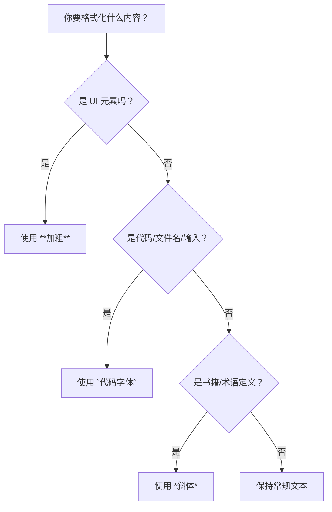

# 文本格式化规范精要

> **页面摘要**：本页汇总了技术文档中最常用的文本格式化约定。通过统一的视觉语言（加粗、斜体、代码字体等），帮助读者快速区分界面操作、术语定义与代码指令。

:::info
> 本规范基于 Google Technical Writing Style Guide 中关于产品命名与引用的相关章节整理而成，并结合中文技术文档的实际写作场景进行了筛选与调整。
> 本文档旨在提供可执行的编辑规范，而非定义官方品牌使用规则。
::: 

## 1. 视觉样式应用快速对照表

为了提高查阅效率，下表总结了不同格式的应用场景及 Markdown 语法：

| 格式类型 | 推荐语法   | 应用场景 |  示例 | 注意 |
|---------|----------  |----------|----------|----------|
| **加粗** | `**文本**` | **UI 元素**、警告 / 注意标题、段首标题 | 点击 **提交** 按钮 |**不要** 加粗关键术语 |
| *斜体*   | `*文本*`   | **术语定义**、书名、数学 / 版本变量、语义强调 | 这种模式被称为 *延迟* 加载 |**不要** 用斜体表示界面按钮 |
| `代码`   |`` `文本` ``| **文件名、类名、方法、变量、用户输入**| 编辑 `config.yaml` 文件 |**不要** 手动修改字体颜色 |
| `<u>下划线</u>` |`<u>文本</u>`  | **仅用于超链接**|[访问谷歌搜索首页](https://Google.com)|**不要** 用下划线强调文字 |

## 2. 逻辑选择流

在决定使用哪种格式时，可以参考以下逻辑图：



## 3. 详细规范与正反例

### 3.1 加粗

* **规范**：仅用于 UI 元素（按钮、菜单、复选框等）和提示信息的标题。

* **Markdown 建议**：在团队内部统一使用 `**文本**` 表示加粗、`*文本*` 表示斜体，以确保代码库风格一致。

### 3.2 斜体

* **规范**：用于引入新术语、数学变量（*x* + *y* = 3）、版本变量（*version 1.4.x*）或长篇作品名（书、电影）。
  * 数学变量示例：设未知数 *x* 和 *y*，方程可写为 `*x*` + `*y*` = 3
  * 版本变量示例：该特性将在 *version 1.4.x* 中引入（其中.x表示小版本通配符）

* **术语策略**：术语在页面中 **第一次出现定义时** 使用斜体，后续再次出现时使用常规字体，无需重复格式化。

* **强调**：如果必须进行语义上的强调，请使用斜体而非加粗或下划线。

  * ✅**推荐**：在本教程中，我们将讨论 *容器化* 技术。
  * ❌**避免**：我们必须 **注意** 安全性。（过度强调）

### 3.3 代码字体

* **规范**：用于所有行内代码、文件名、路径、HTTP 状态码及占位符。

* **代码块**：超过一行的代码段建议使用围栏代码块（```）。
  * ✅**推荐**：返回 `200 OK` 状态码。
  * ❌**避免**：打开 config.json 文件。

### 3.4 标点与大小写

* **标题大小写**：所有标题、导航、文档名称统一使用 **句式大小写** (Sentence case)。
  * ✅**推荐**：Text-formatting summary
  * ❌**避免**：Text-Formatting Summary

* **& 符号**：避免在正文或标题中用 `&` 代替 `and`。
  * ✅**推荐**：身份验证与授权 (Authentication and authorization)
  * ❌**避免**：身份验证 & 授权

* **占位符**：文档中的占位符需使用 **全大写**（如 `YOUR_API_KEY`）。

## 4. 特别提醒：链接中的标点

**重要规则**：引号和结尾标点（如句号、逗号）应置于链接文本的 **外面**。

* ✅**推荐**：关于更多信息，请参阅 \[[Google 写作指南]\]。
* ❌**避免**：关于更多信息，请参阅 \[[Google 写作指南]。\]

---

## 5. 常见问题与边界情况

* **Q1：如果术语本身是代码元素怎么办？**
  * A：优先使用代码字体。例如："`malloc()`函数用于动态内存分配。"

* **Q2：如果术语本身是代码元素怎么办？**
  * A：仅对UI元素部分加粗。例如："在 `Settings.json` 文件中修改配置。"
* **Q3：数学公式较长怎么办？**
  * A：使用独立的数学公式块或代码块，避免使用行内斜体。

最后更新于2026/01/29

[Google 写作指南]: https://developers.google.com/style  